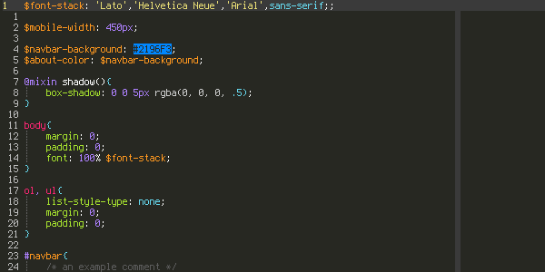
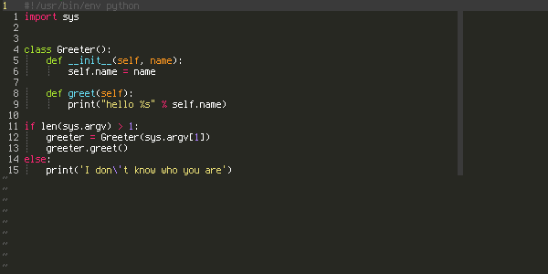

# muble.vim
Vim color scheme based on monokai with plugin support.  

## Preview

**JavaScript**  
  
  
**HTML**  
  

**Sass**  
  

**PHP**  
  

**C**  
  

**Python**  
  

## Installation

muble follows the standard vim plugin folder structure so it should work with
your plugin manager of choice
* [pathogen](https://github.com/tpope/vim-pathogen)
  * run `git clone https://github.com/turbio/muble.vim ~/.vim/bundle/muble.vim`
* [neoBundle](https://github.com/Shougo/neobundle.vim)
  * add `NeoBundle 'turbio/muble.vim'` to your `.vimrc`
* [vundle](https://github.com/VundleVim/Vundle.vim)
  * add `Plugin 'turbio/muble.vim'` to your `.vimrc`
* [plug](https://github.com/junegunn/vim-plug)
  * add `Plug 'turbio/muble.vim'` to your `.vimrc`

## In a Terminal

muble does not substitute 24bit colors with their closest 256 color palette
equivalent (This is because the approximation leads to close but slightly
off color schemes).  
In order to get the correct color when running vim in a terminal you must
set your terminal's color scheme to the muble's color palette.


```
#272822 #f92672 #82b414 #fd971f #268bd2 #8c54fe #56c2d5 #ffffff
#5c5c5c #ff5995 #a6e22e #e6db74 #62ade3 #ae81ff #66d9ef #cccccc
```

## Usage

To set vim's color scheme to muble:
```
:colorscheme muble
```
or put `colorscheme muble` in your `.vimrc` to use muble every time vim starts
